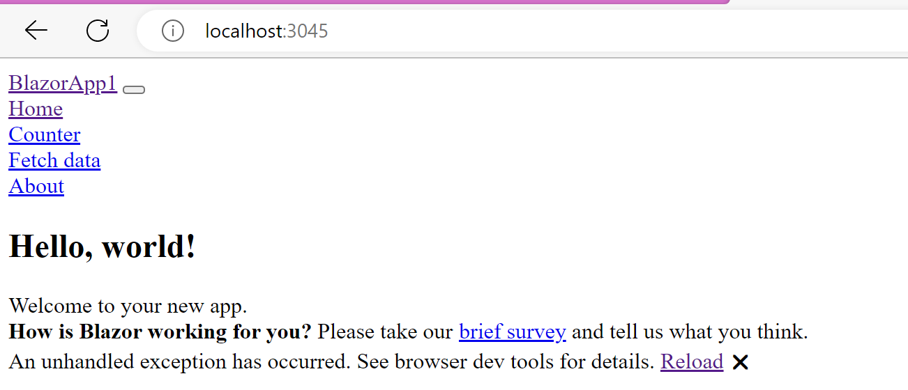

# EmbeddedWebApp
A console app which starts a web app internally

When starting this in Visual Studio / Rider in debug configuration everything looks as expected:


# Build release app

```bash
cd EmbeddedWebApp
dotnet publish -p:PublishSingleFile=true --self-contained true --configuration Release -o  C:\Users\mk\Downloads\testapp
cd C:\Users\mk\Downloads\testapp
.\EmbeddedWebApp
```




